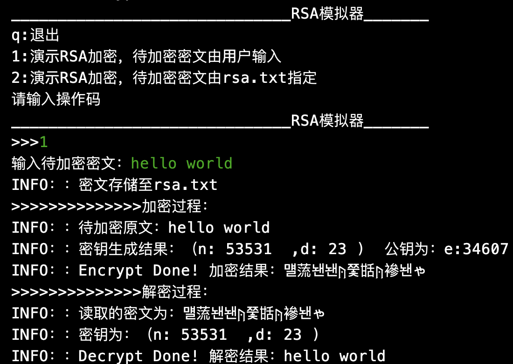
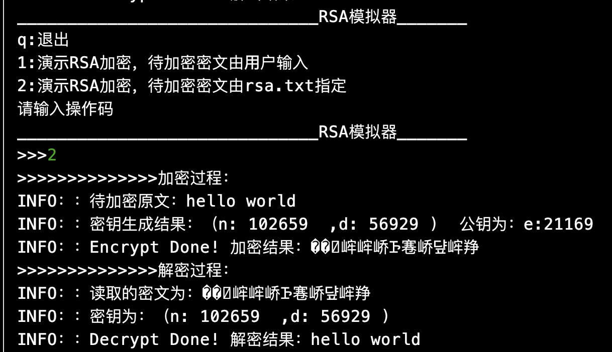

# RSA简易python实现

参考repo：https://github.com/kinnisoy/RSA

## useage

```
python RSA.py
```

或者直接使用IDE运行

## requirements

无要求。详见requirements.txt

## 使用界面

- 功能一



- 功能二



## TODO

- 使用流密码进行密文存储和加密，从而避免字符集的问题，同时借此实现支持多种语言的功能
